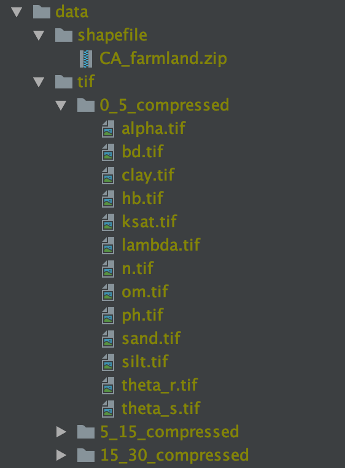

# soil-salinity

This project combines California farmland vector data and satellite soil salinity data and displays the result in an interactive web interface.

## Features

- Aggregation function selection (minimum, maximum, average, standard deviation)
- Raster data selection
- Interactive farmland data front-end interface
- Dynamic extents

## Installation

### Dependencies

The soil salinity backend relies upon Java 1.8.0 and Scala 2.12.7.

### Setup

This project expects all data files (shapefile, GeoTIFF) to be stored in the `data/` directory.
The data directory should be organized as follows:

### Server deployment
Place the `data/` in the `bin/` folder of your Apache Tomcat installation directory.
Apache Tomcat requires the `data/` directory to be placed in the same directory as the Apache Tomcat startup script (i.e) `bin/`. 
Run the command `mvn clean package` to generate a WAR file in the `target/` directory.
The file should be named as `futurefarmnow-backend-0.2-SNAPSHOT.war`.
To deploy this generated WAR file, simply copy it to the `webapps/` directory of your Apache Tomcat installation directory, and start the Tomcat server. 

### API
Check the detailed [API description here](api.md).

## License

Copyright 2021 University of California, Riverside

Licensed under the Apache License, Version 2.0 (the "License");
you may not use this file except in compliance with the License.
You may obtain a copy of the License at

    http://www.apache.org/licenses/LICENSE-2.0

Unless required by applicable law or agreed to in writing, software
distributed under the License is distributed on an "AS IS" BASIS,
WITHOUT WARRANTIES OR CONDITIONS OF ANY KIND, either express or implied.
See the License for the specific language governing permissions and
limitations under the License.